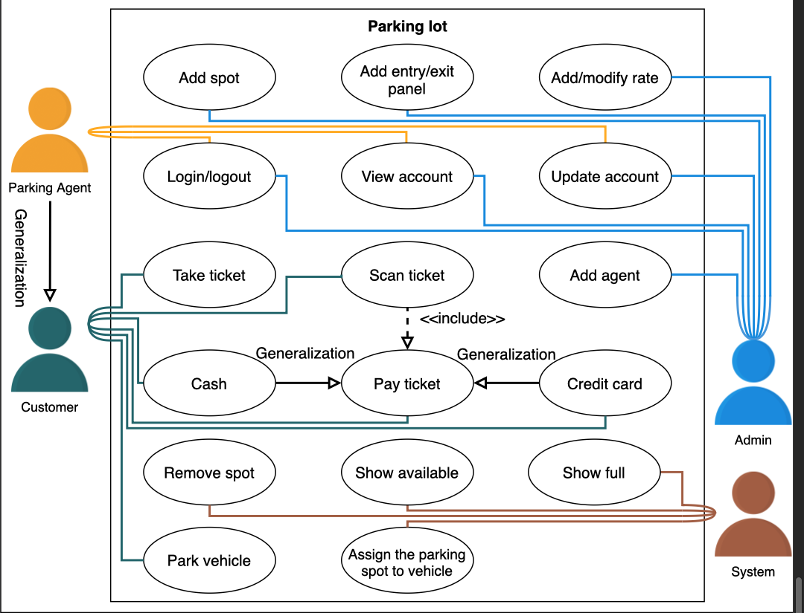
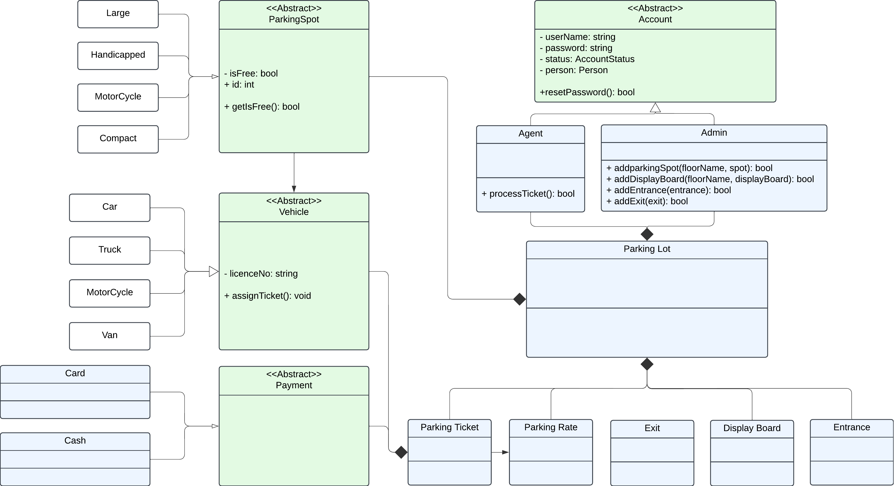

# Problem definition:

A parking lot is a designated area for parking vehicles and is a feature found in almost all popular venues such as 
shopping malls, sports stadiums, offices, etc. In a parking lot, there are a fixed number of parking spots available 
for different types of vehicles. Each of these spots is charged according to the time the vehicle has been parked in 
the parking lot. The parking time is tracked with a parking ticket issued to the vehicle at the entrance of the 
parking lot. Once the vehicle is ready to exit, it can either pay at the automated exit panel or to the parking agent 
at the exit using a card or cash payment method.

## Requirements:

- Parking lot have 50000 slots
- 4 types of parking slots: car, truck, van, motorcycle
- Multiple entrance and exit
- parking lot should have a display showing available slots for each type of slots
- parking lot should close entry if no available slots
- parking ticket should be collect at the entry and payment should be done at the exit
- payment should be collected on hourly rates
- Allow two payments types: card and cash

# Actors & Use case:

- Primary Actors:
  - Customer
    - take a ticket
    - Pay for the ticket
    - Scan the ticket
    - Park the vehicle
    - Pay cash
    - Pay using card
  - Agent
    - Cut ticket
    - Scan ticket
    - View/Update account
    - Collect payment
    - Log in/out
    - Park Vehicle
    - Accept cash/card payment
- Secondary Actors:
  - Admin:
    - Add spot
    - Add agent
    - Add/modify rate
    - Add entry/exit panel
    - Update account
    - Login/Logout
    - View Account
  - System:
    - Process payment
    - Assign parking spot
    - Remove parking spot
    - Show available
    - Show occupied
    - Generate receipt

# Use case Relationships:

### Generalization: 
- Parking agent can perform everything a customer can 
- Cash and credit card have generalization with pay ticket 
### Association:
- Admin with add spot, add agent, add/modify rate, add entry/exit panel, update account, login/logout, view account
- Customer with take a ticket, pay for the ticket, scan the ticket, park the vehicle, pay cash, pay using card
- Agent with cut ticket, scan ticket, view/update account, collect payment, log in/out, park vehicle, accept cash/card payment
- System with process payment, assign parking spot, remove parking spot, show available, show occupied, generate receipt
### Include:
- scan ticket has <<include>> relationship with process payment

# LLD

Following bottoms-up approach to design the system:

##Smaller Components:

- **Vehicle**: Car, Truck, Van, Motorcycle: Enum vs Abstract class: Enum is violation of OCP (classes can be extended but not modified), so we will go with Vehicle
  abstract class (abstract class cannot instantiate the object and can only be used as a base class, t can be extended
  easily in case the vehicle type changes in the future)

- **ParkingSpot**: Similar to Vehicle, we can have an abstract class ParkingSpot and then have subclasses Large, handicapped, Compact, Motorcycle

- **Account**: (Account should also be an abstract class) Parking Agent, Admin

- **Display Board, Entrance and exit, Parking ticket**

- **Payment** will be an abstract class and have two child classes: Cash and Card

- **Parking rate**: The ParkingRate class is responsible for calculating the final payment based on the time spent in the parking lot.

- **Parking lot**: Composed of smaller objects(discussed above)

- **Payment Status and Account Status** will be enumerations because they have fixed values

- Other custom data types: **Address, Person**

## Relationship between the classes

Quick Note: Inheritance (is-A) and implementation (can-do)

### Association: 
(A-----[Not Dotted]-----B) (A and B can call each other)
(A-----[Not Dotted]----->B) (A can call B)

- ParkingSpot can call Vehicle.
- Vehicle can call ParkingTicket.
- Payment can call ParkingTicket.

### Composition: 
(A<>---[Not dotted]---B) A has 1 or more instance of B, B cannot exist without A

- ParkingLot has 1 or more instance of Entrance, Exit, ParkingRate, DisplayBoard, ParkingTicket, and ParkingSpot. Entrance, Exit, ParkingRate, DisplayBoard, ParkingTicket, and ParkingSpot cannot exsist without ParkingLot
- ParkingTicket has 1 instance of Payment, Payment cannot exist without ParkingTicket

### Inheritance: 
(A--[not dotted]---[>b) (A is a B)

- Car, Truck, Van, and MotorCycle is-A Vehicle.
- Handicapped, compact, large, and motorcycle is-A ParkingSpot
- Cash and CreditCard ia-A Payment.

# Design Patter:

- **Factory Pattern**: To create different types of vehicles, parking spots, and payment objects.
- **Singleton Pattern**: To ensure that we have only one instance of the parking lot.

